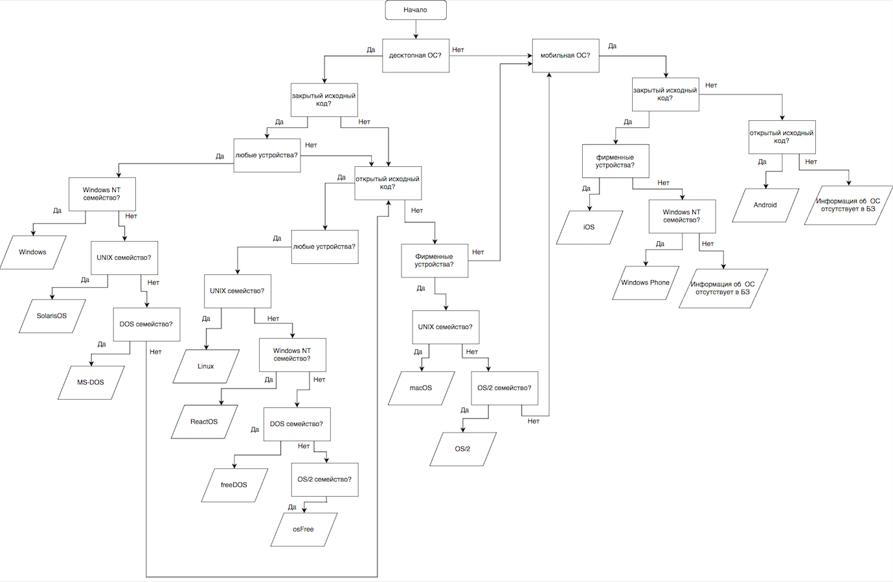

# exp-sys
Экспертные системы на SWI-Prolog. 
Предметная область - Операционные системы.
***

<h1>Описание:</h1>
Экспертная Система, базирующаяся на <b>правилах</b> (файл prod1.pl)- позволяет проектировщику строить правила, которые естественным образом объединяют в группы связанные фрагменты знаний. При этом взаимная независимость продукционных правил делает базу правил семантически модульной и способной к развитию.

Экспертная Система, базирующаяся на <b>логике</b> (файл log1.pl) - База Знаний состоит из утверждений в виде предложений логики предикатов. При этом часть утверждений описывают объекты, другая часть — условия или атрибуты, которые характеризуют различные объекты. Количество признаков определяет степень точности классификации. 

<h2> Запуск: </h2>
Рекомендуется использовать Python 3

```
git clone https://github.com/vadrx/exp-sys
cd exp-sys
swipl log1.pl
swipl prod1.pl
```


<h2>Структурная диаграмма:</h2>



<h2>Пример #1:</h2>

```
"Вопрос : Используется на десктопных устройствах?
1 - да,
2 - нет
|: 1
Вопрос : Имеет закрытый исходный код?
1 - да,
2 - нет
|: 1
Вопрос : Устанавливается на любые устройства?
1 - да,
2 - нет
|: 2
Вопрос : Имеет открытый исходный код?
1 - да,
2 - нет
|: 2
Вопрос : Устанавливается на только фирменные устройства?
1 - да,
2 - нет
|: 1
Вопрос : Относится к семейству UNIX систем?
1 - да,
2 - нет
|: 1
Рекомендуемая Операционная Система : macOS."
```

<h2>Пример #2:</h2>

```
"Вопрос : десктопная ОС?
1 - да,
2 - нет
|: 1
Вопрос : закрытый исходный код?
1 - да,
2 - нет
|: 2
Вопрос : открытый исходный код?
1 - да,
2 - нет
|: 1
Вопрос : любые устройства?
1 - да,
2 - нет
|: 1
Вопрос : UNIX семейство?
1 - да,
2 - нет
|: 2
Вопрос : Windows NT семейство?
1 - да,
2 - нет
|: 2
Вопрос : DOS семейство?
1 - да,
2 - нет
|: 2
Вопрос : OS/2 семейство?
1 - да,
2 - нет
|: 1
Рекомендуемая Операционная Система: osFree."
```